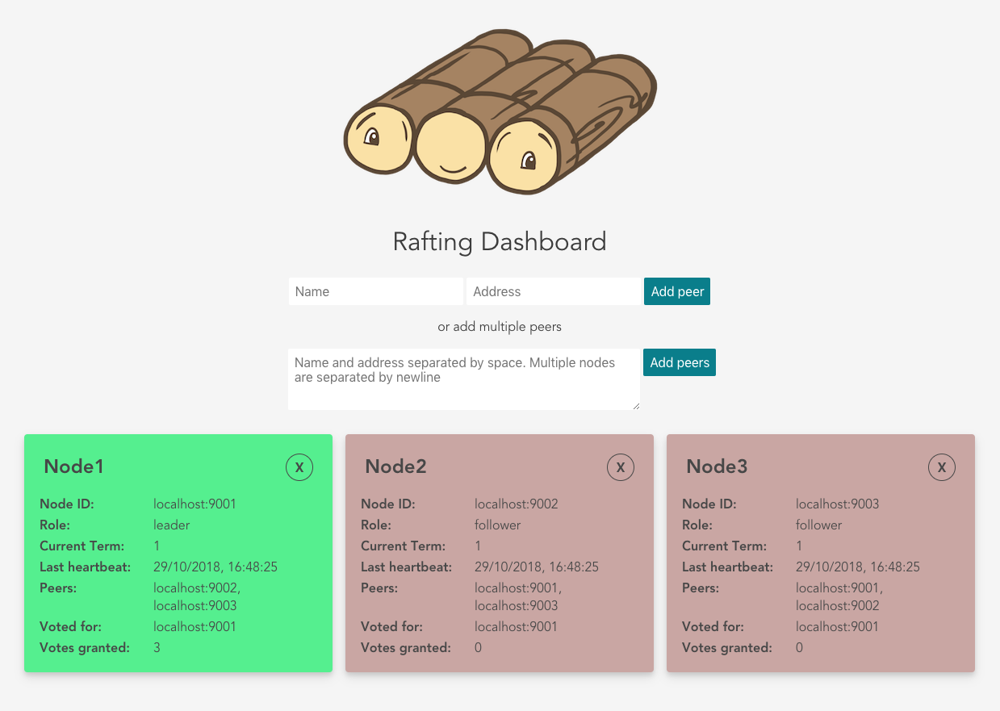

# Raft

This is simplified implementation of [the Raft Consensus Algorithm](https://raft.github.io/).
There is no log replication yet, current implementation can be used to do leader election.

The implementation supports the contract described [there](https://github.com/pbetkier/rafting).
It is recommended to run [dashboard](https://github.com/pbetkier/rafting/tree/master/rafting-dashboard) for watching changes.



## Build
```
go build ./...
```

## Test
```
go test ./...
```

## Run
The first argument is an address that node will bind to. The rest of the arguments are peers.
To run 3 nodes that connect with each other:
```
go cmd/main.go localhost:9001 localhost:9002 localhost:9003
go cmd/main.go localhost:9002 localhost:9001 localhost:9003
go cmd/main.go localhost:9003 localhost:9001 localhost:9002
``` 
